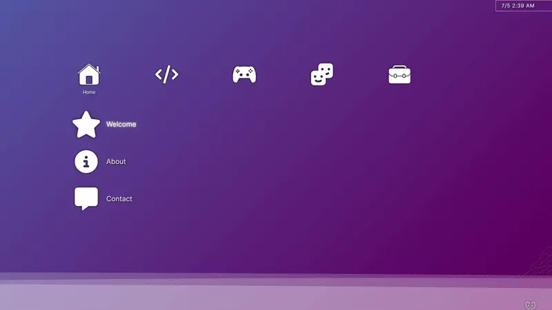

# Gundwn.gg

## Current Deployment

[gundwn.gg](https://gundwn.gg)

## Preview

<p align="center">
  
</p>

## Building

This project has been created using **webpack-cli**, you can now run

```sh
yarn build
```

to bundle your application

## Deployment

The site is deployed to [GitHub pages](https://gundwn.gg) using [GitHub Workflow](/.github/workflows/static.yml).

### Custom Domain

In order to use a domain it must first be configured in the repository settings. Then a `CNAME` file should be created in the root directory ([example](https://github.com/syntax-tm/gundwn.gg/blob/main/CNAME)). You can read more about adding custom domains for GitHub Pages [here](https://docs.github.com/en/pages/configuring-a-custom-domain-for-your-github-pages-site).
